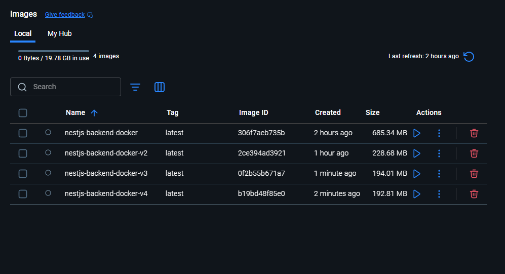

# NestJS Backend — Luyện Tập Docker

Dự án luyện tập đóng gói ứng dụng **NestJS** bằng **Docker**. Bao gồm bốn phiên bản Dockerfile thể hiện quá trình tối ưu theo từng bước.

- **`Dockerfile`** — Build cơ bản, một stage
- **`Dockerfile-v2`** — Multi-stage build, giảm image size
- **`Dockerfile-v3`** — Alpine thuần + non-root user để tăng bảo mật
- **`Dockerfile-v4`** — Áp dụng đầy đủ best practice: explicit UID, LABEL, EXPOSE, `npm ci`

---

## 📁 Cấu Trúc Dự Án

```
NestJS-Backend-Docker/
├── src/
│   └── main.ts
├── Dockerfile          # Single-stage build cơ bản
├── Dockerfile-v2       # Multi-stage build tối ưu
├── Dockerfile-v3       # Alpine base + non-root user
├── Dockerfile-v4       # Áp dụng đầy đủ best practice
├── .dockerignore
└── ...
```

---

## 🐳 Dockerfile Cơ Bản (`Dockerfile`)

Build **single-stage** đơn giản — dễ hiểu, phù hợp để học.

```dockerfile
FROM node:20.20-alpine3.23

WORKDIR /usr/src/app

COPY package*.json ./

RUN npm install

COPY . .

RUN npm run build

EXPOSE 3000

CMD ["node", "dist/main"]
```

**Nhược điểm:** Image cuối chứa cả `devDependencies` và source code gốc, dẫn đến image size lớn hơn cần thiết.

### Build & Chạy

```bash
docker build -t nestjs-app .
docker run -p 3000:3000 nestjs-app
```

---

## 🚀 Dockerfile Tối Ưu (`Dockerfile-v2`)

**Multi-stage build** — tách biệt giai đoạn build và production, giảm đáng kể image size.

```dockerfile
# Build stage
FROM node:20.20-alpine3.23 AS development

WORKDIR /usr/src/app
COPY package*.json ./
RUN npm install glob rimraf
RUN npm install --include=dev
COPY . .
RUN npm run build

# Production stage
FROM node:20.20-alpine3.23 AS production

ARG NODE_ENV=production
ENV NODE_ENV=${NODE_ENV}

WORKDIR /usr/src/app
COPY package*.json ./
RUN npm install --production
COPY . .
COPY --from=development /usr/src/app/dist ./dist

CMD ["node", "dist/main"]
```

**Ưu điểm:**
- Image production **không chứa** `devDependencies`
- Chỉ copy artifact `dist/` từ build stage
- Image size nhỏ hơn đáng kể so với single-stage

### Build & Chạy

```bash
docker build -f Dockerfile-v2 -t nestjs-app:v2 .
docker run -p 3000:3000 nestjs-app:v2
```

---

## 🔐 Dockerfile Bảo Mật (`Dockerfile-v3`)

Xây dựng dựa trên `Dockerfile-v2` với hai cải tiến thêm:

1. **Alpine thuần** (`alpine`) thay vì `node:alpine` → image nhỏ hơn
2. **Non-root user** (`nestjs`) → tuân thủ nguyên tắc least privilege

```dockerfile
# Global ARGs phải khai báo trước FROM đầu tiên
ARG ALPINE_VERSION=3.23
ARG NODE_VERSION=20.20

# Build stage
FROM node:20.20-alpine3.23 AS development

WORKDIR /usr/src/app
COPY package*.json ./
RUN npm install glob rimraf
RUN npm install --include=dev
COPY . .
RUN npm run build

# Production stage — Alpine thuần
FROM alpine:${ALPINE_VERSION}

RUN adduser -D nestjs
RUN apk add --no-cache nodejs npm

ARG NODE_ENV=production
ENV NODE_ENV=${NODE_ENV}

WORKDIR /usr/src/app
COPY package*.json ./
RUN npm install --production
COPY . .
COPY --from=development /usr/src/app/dist ./dist

RUN chown -R nestjs:nestjs /usr/src/app
USER nestjs

CMD ["node", "dist/main"]
```

**Ưu điểm so với v2:**
- Dùng `alpine` thuần thay vì `node:alpine` → image nhỏ hơn
- Chạy app bằng **non-root user** (`nestjs`) → bảo mật tốt hơn
- Global `ARG` cho version base image → dễ quản lý phiên bản

> **Lưu ý:** Trong multi-stage build, `ARG` dùng trong lệnh `FROM` phải khai báo **trước** `FROM` đầu tiên (global scope). Bên trong mỗi stage, `ARG` chỉ có hiệu lực trong stage đó.

### Build & Chạy

```bash
docker build -f Dockerfile-v3 -t nestjs-app:v3 .
docker run -p 3000:3000 nestjs-app:v3
```

---

## 🏆 Dockerfile Tối Ưu Nhất (`Dockerfile-v4`)

Áp dụng đầy đủ các best practice từ [tài liệu chính thức Docker](https://docs.docker.com/build/building/best-practices/), cải tiến từng điểm so với `Dockerfile-v3`.

```dockerfile
# Global ARG for base image version
ARG ALPINE_VERSION=3.23

# Build stage
FROM node:20.20-alpine3.23 AS development

WORKDIR /usr/src/app

COPY package*.json ./

# Gộp 2 lệnh install thành 1 layer duy nhất
RUN npm install glob rimraf && npm install --include=dev

COPY . .

RUN npm run build

# Production stage — pure Alpine base
FROM alpine:${ALPINE_VERSION}

# LABEL: metadata cho maintainability
LABEL maintainer="yourname@example.com" \
      version="1.0.0" \
      description="NestJS production image"

# Explicit UID/GID — đảm bảo tính xác định (deterministic)
RUN adduser -D -u 1001 nestjs

RUN apk add --no-cache nodejs npm

ARG NODE_ENV=production
ENV NODE_ENV=${NODE_ENV}

WORKDIR /usr/src/app

COPY package*.json ./

# npm ci --omit=dev: thay thế --production (deprecated), reproducible hơn
RUN npm ci --omit=dev

# Chỉ copy dist — không COPY . . thừa
COPY --from=development /usr/src/app/dist ./dist

RUN chown -R nestjs:nestjs /usr/src/app
USER nestjs

# EXPOSE: tài liệu hóa port
EXPOSE 3000

CMD ["node", "dist/main"]
```

**Cải tiến so với v3:**

| # | Điểm cải tiến |
|---|---|
| 1 | Gộp 2 `RUN npm install` → 1 layer, giảm số layer |
| 2 | `adduser -D -u 1001` — UID tường minh, không bị thay đổi khi rebuild |
| 3 | `npm ci --omit=dev` — thay `--production` (deprecated), nhanh hơn, reproducible |
| 4 | Bỏ `COPY . .` — chỉ copy `dist/` và `package.json` cần thiết |
| 5 | Thêm `LABEL` — metadata cho dễ bảo trì và audit |
| 6 | Thêm `EXPOSE 3000` — tài liệu hóa port của ứng dụng |

### Build & Chạy

```bash
docker build -f Dockerfile-v4 -t nestjs-app:v4 .
docker run -p 3000:3000 nestjs-app:v4
```

---

## 📊 So Sánh

| Tính năng | `Dockerfile` | `Dockerfile-v2` | `Dockerfile-v3` | `Dockerfile-v4` |
|---|---|---|---|---|
| Số stage | 1 | 2 | 2 | 2 |
| Base image (production) | `node:alpine` | `node:alpine` | `alpine` | `alpine` |
| `devDependencies` trong image | ✅ Có | ❌ Không | ❌ Không | ❌ Không |
| Non-root user | ❌ | ❌ | ✅ | ✅ |
| Explicit UID | ❌ | ❌ | ❌ | ✅ |
| `--no-cache` apk | ❌ | ❌ | ✅ | ✅ |
| `npm ci --omit=dev` | ❌ | ❌ | ❌ | ✅ |
| `LABEL` metadata | ❌ | ❌ | ❌ | ✅ |
| `EXPOSE` port | ✅ | ❌ | ❌ | ✅ |
| **Image size thực tế** | **685.34 MB** | **228.68 MB** | **194.01 MB** | **192.81 MB** |

### 📸 Bằng chứng build thực tế



---

## ⚙️ Chạy Thủ Công (Không Dùng Docker)

```bash
# Cài đặt dependencies
npm install

# Chế độ development
npm run start:dev

# Chế độ production
npm run build
npm run start:prod
```

---

## 🔧 Yêu Cầu

- [Node.js](https://nodejs.org/) >= 20
- [Docker](https://www.docker.com/) >= 24

---

## 💡 Best Practice Khi Viết Dockerfile

> Nguồn: [Docker Official Docs — Building best practices](https://docs.docker.com/build/building/best-practices/)

### 1. Dùng Multi-stage Build

Multi-stage build giảm image size bằng cách tách biệt môi trường build và runtime. Chỉ những file cần thiết để chạy ứng dụng mới có mặt trong image cuối. Nhiều stage cũng giúp build song song, tăng hiệu quả.

```dockerfile
FROM node:20-alpine AS development
# cài devDeps, compile...

FROM alpine AS production
COPY --from=development /app/dist ./dist   # chỉ copy artifact đã build
```

### 2. Chọn Base Image Phù Hợp

Docker khuyến nghị dùng **Alpine image** — nhỏ gọn (dưới 6 MB), được kiểm soát chặt chẽ và vẫn là một bản Linux đầy đủ. Ưu tiên base image nhỏ để giảm attack surface và dung lượng.

```
node:20        (~1 GB)   ← tránh dùng trong production
node:20-alpine (~180 MB)
alpine         (~7 MB)   ← nhỏ nhất
```

### 3. Tận Dụng Build Cache

Docker cache từng layer. Đặt các lệnh **ít thay đổi nhất lên trên** để Docker có thể tái sử dụng cache và bỏ qua các bước tốn thời gian.

```dockerfile
# ✅ Đúng thứ tự
COPY package*.json ./
RUN npm install        # cache layer này nếu package.json không đổi
COPY . .               # source thay đổi thường xuyên → đặt sau

# ❌ Sai: bất kỳ thay đổi nào ở source đều buộc npm install chạy lại
COPY . .
RUN npm install
```

### 4. Pin Version của Base Image

Image tag có thể thay đổi — `alpine:3.23` hôm nay có thể trỏ đến patch version khác vào lần sau. Để build hoàn toàn reproducible, pin bằng **digest**:

```dockerfile
# ❌ Tag có thể thay đổi
FROM alpine:3.23

# ✅ Pin bằng digest — luôn dùng đúng image đó
FROM alpine:3.23@sha256:25109184c71bdad752c8312a8623239686a9a2071e8825f20acb8f2198c3f659
```

### 5. Dùng `.dockerignore`

Dùng `.dockerignore` để loại bỏ các file không cần thiết khỏi build context, giảm thời gian build và tránh vô tình đưa file nhạy cảm vào image.

```
node_modules
dist
.git
*.log
.env
```

### 6. Không Cài Package Không Cần Thiết

Mỗi package thêm vào đều làm tăng image size, attack surface và độ phức tạp. Chỉ cài những gì thực sự cần để chạy app trong production.

### 7. Chạy Bằng Non-root User (`USER`)

Nếu service không cần quyền root, dùng `USER` để chuyển sang user khác. Docker khuyến nghị tạo user với UID/GID cụ thể để đảm bảo tính xác định.

```dockerfile
RUN groupadd -r appuser && useradd --no-log-init -r -g appuser appuser
USER appuser
```

> Tránh dùng `sudo` trong container — có thể gây ra hành vi không thể đoán trước với TTY và signal forwarding.

### 8. Dùng `WORKDIR` với Đường Dẫn Tuyệt Đối

Luôn dùng đường dẫn tuyệt đối cho `WORKDIR`. Tránh chuỗi lệnh `RUN cd ... && do-something` vì dễ gây lỗi và khó bảo trì.

```dockerfile
# ✅
WORKDIR /usr/src/app

# ❌
RUN cd /usr/src/app && npm install
```

### 9. Gộp Các Lệnh `RUN` Có Liên Quan

Mỗi `RUN` tạo một layer mới. Gộp các lệnh liên quan bằng `&&` và luôn dọn cache trong cùng một bước để tránh làm phình layer.

```dockerfile
# ❌ 3 layer riêng, còn sót cache
RUN apk update
RUN apk add nodejs
RUN apk add npm

# ✅ 1 layer, không còn cache thừa
RUN apk add --no-cache nodejs npm
```

Với Debian/Ubuntu:
```dockerfile
RUN apt-get update && apt-get install -y --no-install-recommends \
    nodejs \
    npm \
    && rm -rf /var/lib/apt/lists/*
```

### 10. Dùng `LABEL` Để Thêm Metadata

Thêm label để ghi lại thông tin version, tác giả, bản quyền — hữu ích cho automation và kiểm toán.

```dockerfile
LABEL maintainer="yourname@example.com" \
      version="1.0.0" \
      description="NestJS production image"
```

### 11. Dùng `EXPOSE` Để Tài Liệu Hóa Port

`EXPOSE` **không** publish port — nó chỉ tài liệu hóa port mà container lắng nghe. Luôn khai báo để người dùng image biết cần map port nào.

```dockerfile
EXPOSE 3000
```

### 12. Build và Test Trong CI

Dùng GitHub Actions hoặc CI/CD pipeline khác để tự động build, tag và test Docker image mỗi khi có push hoặc pull request.

---

## 🔍 Những Điểm Có Thể Cải Thiện Trong `Dockerfile-v3`

`Dockerfile-v3` đã áp dụng nhiều best practice tốt (multi-stage build, Alpine base, `--no-cache`, non-root user). Dưới đây là các điểm còn có thể cải thiện thêm:

| # | Vấn đề | Hiện tại | Đề xuất cải tiến |
|---|---|---|---|
| 1 | **Image chưa pin bằng digest** | `FROM alpine:3.23` | `FROM alpine:3.23@sha256:...` để build reproducible |
| 2 | **Hai lệnh `RUN npm install` riêng** | 2 layer riêng | Gộp lại thành 1 `RUN` để giảm số layer |
| 3 | **Thiếu `EXPOSE`** | Không có | Thêm `EXPOSE 3000` để tài liệu hóa port |
| 4 | **Thiếu `LABEL` metadata** | Không có | Thêm `LABEL` cho maintainer, version, mô tả |
| 5 | **UID/GID không xác định** | `adduser -D nestjs` | Dùng UID tường minh: `adduser -D -u 1001 nestjs` |
| 6 | **`--production` đã deprecated** | `npm install --production` | Dùng `npm ci --omit=dev` để install sạch hơn |
| 7 | **`COPY . .` dư thừa** | Copy toàn bộ source vào production | Bỏ đi — chỉ cần `dist/` và `package.json` |

---

### Tổng Kết

| Best Practice | v1 | v2 | v3 |
|---|---|---|---|
| Multi-stage build | ❌ | ✅ | ✅ |
| Base image nhỏ (`alpine`) | ✅ | ✅ | ✅✅ |
| Tận dụng layer cache | ✅ | ✅ | ✅ |
| Non-root user | ❌ | ❌ | ✅ |
| Không có devDependencies | ❌ | ✅ | ✅ |
| `--no-cache` cho apk | ❌ | ❌ | ✅ |
| **Image size thực tế** | **685 MB** | **229 MB** | **200 MB** |
